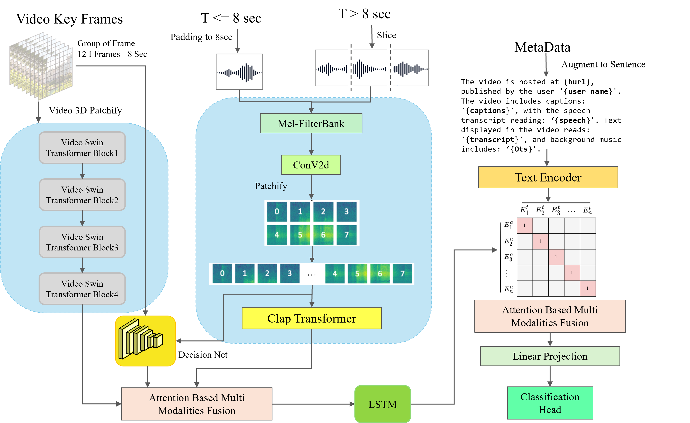

# Real Time Fake News Detection

## Introduction 
The Overview of the proposed algorithm.
<p align="center">
  
</p>
Fake news detection has become an increasingly critical task as misinformation spreads rapidly 
across social media and digital platforms. While early research focused on textual content, 
the rise of multimedia content—especially short videos—has introduced new challenges in detecting 
fake news. Videos combine multiple modalities, such as visual, textual, and sometimes audio 
components, making it difficult to assess the authenticity of the information. Current methods 
often rely on analyzing individual modalities, such as video frames or transcripts, limiting 
their ability to grasp the full scope of misleading content. Detecting fake news in short videos 
is not only crucial for ensuring the integrity of information but also has broader implications 
for public trust and decision-making. Future applications of this task range from real-time 
content moderation to automated fact-checking systems, capable of processing and evaluating 
vast quantities of user-generated content in seconds.


## Environment
Training and evaluation environment: Python 3.10.0, PyTorch 2.5.0, CUDA 11.8. 

Run the following command to create the 
conda environment and install required packages.

```
conda create -n LungHeart python==3.10.0 -y
conda activate LungHeart
pip3 install torch torchvision torchaudio
pip3 install tqdm
pip3 install wandb
pip3 install pandas
pip3 install scikit-learn
pip3 install transformers
pip3 install albumentations
pip3 install fvcore
pip3 install mmcv
```

## Dataset

We conduct experiments on two datasets: FIDES and FakeTT.

The training, validating and testing dataset are both subset from each dataset.

FIDES is our newly constructed English dataset for a comprehensive evaluation in English-speaking contexts.

FakeTT is a large English dataset for fake news detection on short video platforms. 
For the details, please refer to [FakeTT]: https://github.com/ICTMCG/FakingRecipe/tree/main

Arrange the dataset folder as follows:

```
FIDES
│
├── all_data.csv  # text content and labels
├── train.csv  # Official data split
├── test.csv 
│
├── videos/  #video files
│   └── \*.txt  # Each short video
│
├── audios/ # Audio files
│   └── \*.wav
│
├── video_feas/ # Preprocessed video features
│   └── \*.pkl
│
└── audio_feas/ # Preprocessed audio features
    └── \*.pkl
```

```
FakeTT
│ 
├── data.json          # Official data split 
│
├── videos/  #video files
│   └── \*.txt  # Each short video
│
└──  audios/ # Audio files
    └── \*.wav
```

## Training

Before training, please download the datasets and complete environment configuration, please download the pretrained
video swin transformer from [Video-Swin-Transformer]: https://github.com/SwinTransformer/storage/releases/download/v1.0.4/swin_base_patch244_window1677_sthv2.pth
```
 wget https://github.com/SwinTransformer/storage/releases/download/v1.0.4/swin_base_patch244_window1677_sthv2.pth
```

Then configure the model in `./config/FIDES.yaml`.

Use the following code to start the training process. Suppose the root path of dataset is '/dataset/FakeTT/'

```
python main.py \
    --exp_name= FakeNewDetection \
    --config='./config/FIDES.yaml' \
    --work_dir=./experiments/ \
```

The testing result will be saved at './experiments/save/'.

The best checkpoint will be saved at './experiments/ckpt/'.

## Testing

Before testing, please download the datasets and complete environment configuration, and use the default configuration in `./config/ICBHIModel.yaml`.

Use the following code to start the testing process. Suppose the root path of dataset is '/dataset/ICBHI/'.

```
python main.py \
    --exp_name= FakeNewDetection \
    --config='./config/FIDES.yaml' \
    --work_dir=./experiments/ \
    --ckpt_path='./best_ckpt.pth'
    --vis \
    --test \
```

The testing result will be saved at './experiments/save/'.
The F measure result and the computational analysis result will be print on the screen.

## License
The code is released under the MIT License. It is a short, permissive software license. Basically, you can do whatever you want as long as you include the original copyright and license notice in any copy of the software/source.

